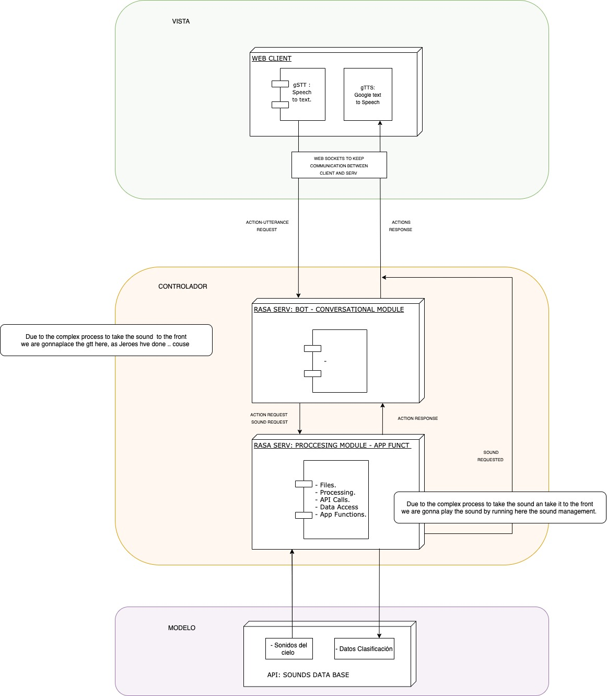
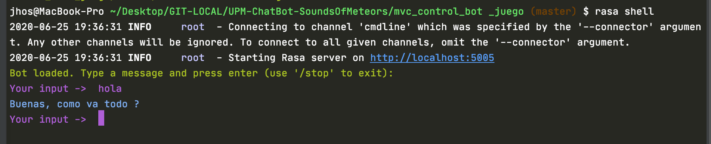
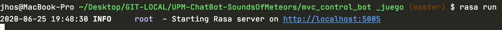
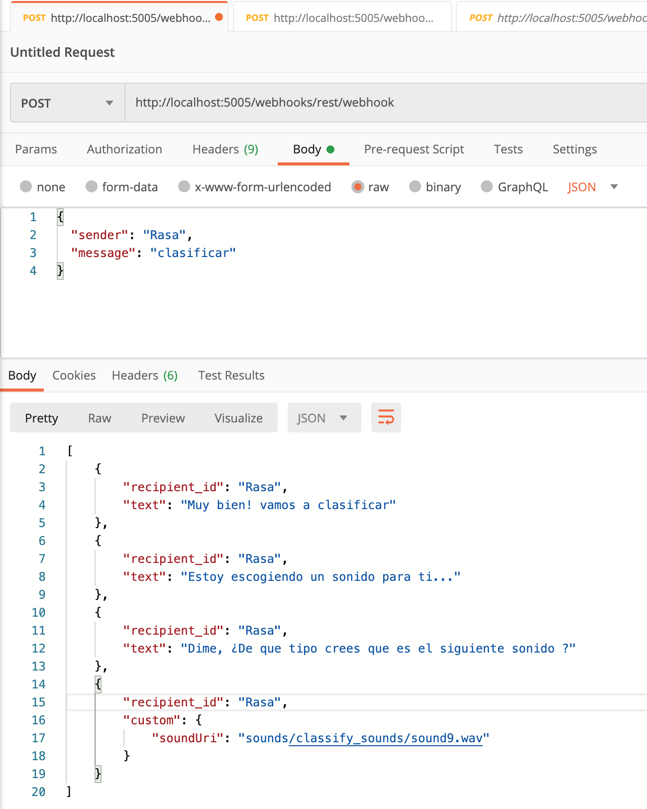

#  ChatBot para Clasificar Sonidos del Cielo
> Sky Sounds Chatbot Classifier 

---
##  Tabla de contenidos


- [Introduccíon](#Introducción)
- [About](#Acerca )
- [Arquitectura](#Arquitectura)
- [Instalación](#instalación)
- [Features](#features)
- [Contributing](#contributing)
- [Team](#team)
- [FAQ](#faq)
- [Support](#support)
- [License](#license)


---

 
 ## Introducción
 - En este proyecto emplearemos python como tecnologia para poder desarrollar el bot, el cual seguira una implementacion marcada por RASA . 
---
 ## About

  - 🇬🇧 This chatbot is being developed by [Jhosef A. Cardich Palma](https://www.linkedin.com/in/jhosef-anderson-cardich-palma-74765788/) as part of his Final Degree Project (TFG) for the [Polytechnic University of Madrid ](https://www.upm.es/) as a part of its Computer Science Degree on the [Higher Technical School of Computer Engineers](https://www.fi.upm.es/). The  ***Sky Sounds Chatbot Classifier***  is an application that offers an entertaining experience to classify sounds from the sky,  bringing the general public closer to science.This application is part of
[Star counter](http://www.contadoresdeestrellas.org/), it's a big project with the collaboration of  ***Instituto Astrofísico de Canarias***. 

---
  - 🇪🇸 Este proyecto esta siendo desarrollado por [Jhosef A. Cardich Palma](https://www.linkedin.com/in/jhosef-anderson-cardich-palma-74765788/) como el trabajo de fin de carrera en la [Universidad Politécnica de Madrid](https://www.upm.es/) para el grado de Ingeniería Informática en la [Escuela Técnica Superior de Ingenieros Informáticos](https://www.fi.upm.es/). La aplicación ***Chatbot Clasificador de Sonidos del Cielo*** tiene como objetivo la realizacion de un bot para el publico infanti, el cual podra clasificar los sonidos del cielo interactuando con el asistente virtual.  Esta aplición forma parte de un proyecto mas grande. [Contadores de Estrellas](http://www.contadoresdeestrellas.org/) es un proyecto realizado en colaboración con el ***Instituto Astrofísico de Canarias***.


 

 ---
## Arquitectura

Para la implementación general se ha seguido un patrón ***Modelo Vista Controlador (MVC)*** , para definir los componentes y sus interacciones. 
Let's take a look how this project architecture looks like:

 ***Organización MVC del Proyecto***

 


## Instalación

 - En este repositorio se encuentra el proyecto, en el que se incluye el entorno virtual con el que se ha trabajado en  local (carpeta venv)
 sin embargo, en esta carpeta, se encuentra otra llamada "lib" (/venv/lib), la cual no se esta sincronizando con el repositorio aqui (pero si usa en local), debido a que  esta carpeta tiene dos modulos que pesan demasiado, por ello es recomendable, si deseas hacer funcionar esto:
 #### Configuración Entorno
 
 
 - Una vez clonado el proyecto, hay que hacer una serie de comprobaciones. Se ha usado Pycharm para el desarrollo del Bot, por ello se recomienda usarlo. Hay que asegurarnos que estamos usando la version de Phyton 3.7 y que el entorno venv esta configurado correctamente, también lo haremos cuando hayamos instalado RASA. Podemos encontras las configuraciones en : 

 > Abrir el proyecto con Pycharm:

 ```
Pycharm > preferencias .. 
 ```

- Instalar los paquetes del framework RASA :

Este paso es necesario, ya que de otra maneras no podrems usar las caracteristicas de nuestro bot, como entrenarlo, definirlo o exponerlo para consuimirlo.


reinstalara las dependencias que estan dentro de venv y asi instalara las que faltan también.

 - Una vez istalado podemos empezar a interactuar via teclado con nuestro bot ejecutando en la terminal: 
 - Ojo cuidado que en reinstalar rasa dentro de venv pesa mucho asi que hay que ver como arreglar lo de las dependencias


### Configuración del módulo del juego y del ChatBot


 ###  Modulo Back - Lógica del Juego
***Servicios  RASA***

  Otra parte escencial del proyecto es la lógica del juego, para ello se ha desarrollado una aplicación en Phyton, integrada en framework de RASA, la cuál define las funcionalidad de acceso a los sonidos, la clasificación, almacenamiento de los datos de clasificación, y otros procesamientos independientes de la parte conversacional que es el bot. Estos servicios serán usados por el bot cuando este reconozca un comando por parte del usuario.

- Para iniciar los servicios solo tenemos que situarnos en el directorio anterior y ejcutar el siguiente comando:

 ```
$ rasa run actions...
 ```
 ### Módulo Back - ChatBot


- Para entrenar nuestro modelo nos situamos en el siguiente directorio:
 ```
 "/UPM-ChatBot-SoundsOfMeteors/mvc_control_bot_juego"
 ```
 - Estando ya en el directorio, ejecutamos el siguiente comando para entrenar el modelo:
 ```
 $ rasa train 
 ```
 - Una vez que nuestro rasa ha terminado de formar el universo de nuestro bot este se encuentra ya listo para poder usarlo. Entonces podemos conversar con el bot conectando un frontal web o la consola de comandos. La segunda opción es la mas inmediata. Para poder comunicarnos con nuestro bot via consola,  ejecutamos el siguiente comando en una terminal. Este inicia el servidor RASA y ademas nos da una terminal de entrada para poder comunicarnos via texto con nuestro bot: 
> Para iniciar el servidor rasa donde correra nuestro bot:
  ```
$ rasa shell
  ```
- Si el comando se ha realizado con éxito, se mostrara un mensaje como este:

 

---
## Integración con APPS externas
En el caso de la integración con aplicaciones externas lo que tenemos que hacer para poner disponible los servicios de nuestro bot. Se pueden realizar pruebas sobre mensajes con el software postman. En ese caso sencillo hay que exponer los servicios de nuestro bot con el siguiente comando:
***Consumir mediante POSTMAN***
> Exponer los servicios de nuestro bot
- Nos situamos siempre en el directorio donde hemos entrenado nuestro bot y ejecutamos:
```
$ rasa run
```
- En el caso de que el servidor se haya iniciado sin nigun problema, el aspecto de la terminar es la siguiente: 

 

***Consumir Mediante un Navegador - Cliente Web***
> Exponer los servicios de nuestro bot con Extra Google Chrome
- Si queremos consumir el modulo controlador desde un navegador, es decir, conectar el frontal con el Back del proyecto, hay que usar el siguiente comando que nos desactivara ciertas características de seguridad de RASA las cuales entran en conflicto con los navegadores. Esto se tiene que hacer al usar el frontal creado para el proyecto. Ejecutar el siguiente comando:

```
rasa run --enable-api --cors "*"
```
> Consumir  servicios

- Podremos consumir los servicios en la siguiente URI (`POST`): 
```
http://localhost:5005/webhooks/rest/webhook
```
---

Una prueba de operación `POST` en postman, donde se ve el mensaje enviado y la contestación del Bot. Hay que notar un detalle, y es que el la ultima parte del mensaje enviado por el bot ha sido generado por la aplicación del juego definida en las acciones de RASA, las cuales estan activas porque las hemos activado previamente (Modulo Back - Lógica del Juego) .

 

 En ese momento lo servicios estaran disponibles para que nuestro bot pueda llamarlos si reconoce alguno en la conversacion con el usuario.

---
## Configuración del Frontal

Por la arquitectura propuesta, se ha desarrollado una aplicación frontal  basada en el framework Web de Django.
- Para poder hacer funcionar el frontal de la aplicación tenemos que situarnos el diretorio:
```
/UPM-ChatBot-SoundsOfMeteors/mvc_vista_frontal/mysite
```
- Hay que arrancar el servidor de la siguiente manera: 
```shell
$ python3 manage.py runserver 0.0.0.0:8000

```
 


***INSERT ANOTHER GRAPHIC HERE***

[]()

- Most people will glance at your `README`, *maybe* star it, and leave
- Ergo, people should understand instantly what your project is about based on your repo

> Tips

- HAVE WHITE SPACE
- MAKE IT PRETTY
- GIFS ARE REALLY COOL

> GIF Tools

- Use <a href="http://recordit.co/" target="_blank">**Recordit**</a> to create quicks screencasts of your desktop and export them as `GIF`s.
- For terminal sessions, there's <a href="https://github.com/chjj/ttystudio" target="_blank">**ttystudio**</a> which also supports exporting `GIF`s.

**Recordit**


**ttystudio**


## Example (Optional)

```javascript
// code away!

let generateProject = project => {
  let code = [];
  for (let js = 0; js < project.length; js++) {
    code.push(js);
  }
};
```

---

## Installation

- All the `code` required to get started
- Images of what it should look like

### Clone

- Clone this repo to your local machine using `https://github.com/fvcproductions/SOMEREPO`

### Setup

- If you want more syntax highlighting, format your code like this:

> update and install this package first

```shell
$ brew update
$ brew install fvcproductions
```

> now install npm and bower packages

```shell
$ npm install
$ bower install
```

- For all the possible languages that support syntax highlithing on GitHub (which is basically all of them), refer <a href="https://github.com/github/linguist/blob/master/lib/linguist/languages.yml" target="_blank">here</a>.


## Features
## Usage (Optional)
## Documentation (Optional)
## Tests (Optional)

- Going into more detail on code and technologies used
- I utilized this nifty <a href="https://github.com/adam-p/markdown-here/wiki/Markdown-Cheatsheet" target="_blank">Markdown Cheatsheet</a> for this sample `README`.

---

## Contributing

> To get started...

### Step 1

- **Option 1**
    - 🍴 Fork this repo!

- **Option 2**
    - 👯 Clone this repo to your local machine using `https://github.com/joanaz/HireDot2.git`

### Step 2

- **HACK AWAY!** 🔨🔨🔨

### Step 3

- 🔃 Create a new pull request using <a href="https://github.com/joanaz/HireDot2/compare/" target="_blank">`https://github.com/joanaz/HireDot2/compare/`</a>.

---

## Team

> Or Contributors/People

| <a href="http://fvcproductions.com" target="_blank">**FVCproductions**</a> | <a href="http://fvcproductions.com" target="_blank">**FVCproductions**</a> | <a href="http://fvcproductions.com" target="_blank">**FVCproductions**</a> |
| :---: |:---:| :---:|
| [](http://fvcproductions.com)    | [](http://fvcproductions.com) | [](http://fvcproductions.com)  |
| <a href="http://github.com/fvcproductions" target="_blank">`github.com/fvcproductions`</a> | <a href="http://github.com/fvcproductions" target="_blank">`github.com/fvcproductions`</a> | <a href="http://github.com/fvcproductions" target="_blank">`github.com/fvcproductions`</a> |

- You can just grab their GitHub profile image URL
- You should probably resize their picture using `?s=200` at the end of the image URL.

---

## FAQ

- **How do I do *specifically* so and so?**
    - No problem! Just do this.

---

## Support

Reach out to me at one of the following places!

- Website at <a href="http://fvcproductions.com" target="_blank">`fvcproductions.com`</a>
- Twitter at <a href="http://twitter.com/fvcproductions" target="_blank">`@fvcproductions`</a>
- Insert more social links here.

---

## Donations (Optional)

- You could include a <a href="https://cdn.rawgit.com/gratipay/gratipay-badge/2.3.0/dist/gratipay.png" target="_blank">Gratipay</a> link as well.

[](https://gratipay.com/fvcproductions/)


---

## License

[](http://badges.mit-license.org)

- **[MIT license](http://opensource.org/licenses/mit-license.php)**
- Copyright 2015 © <a href="http://fvcproductions.com" target="_blank">FVCproductions</a>.
