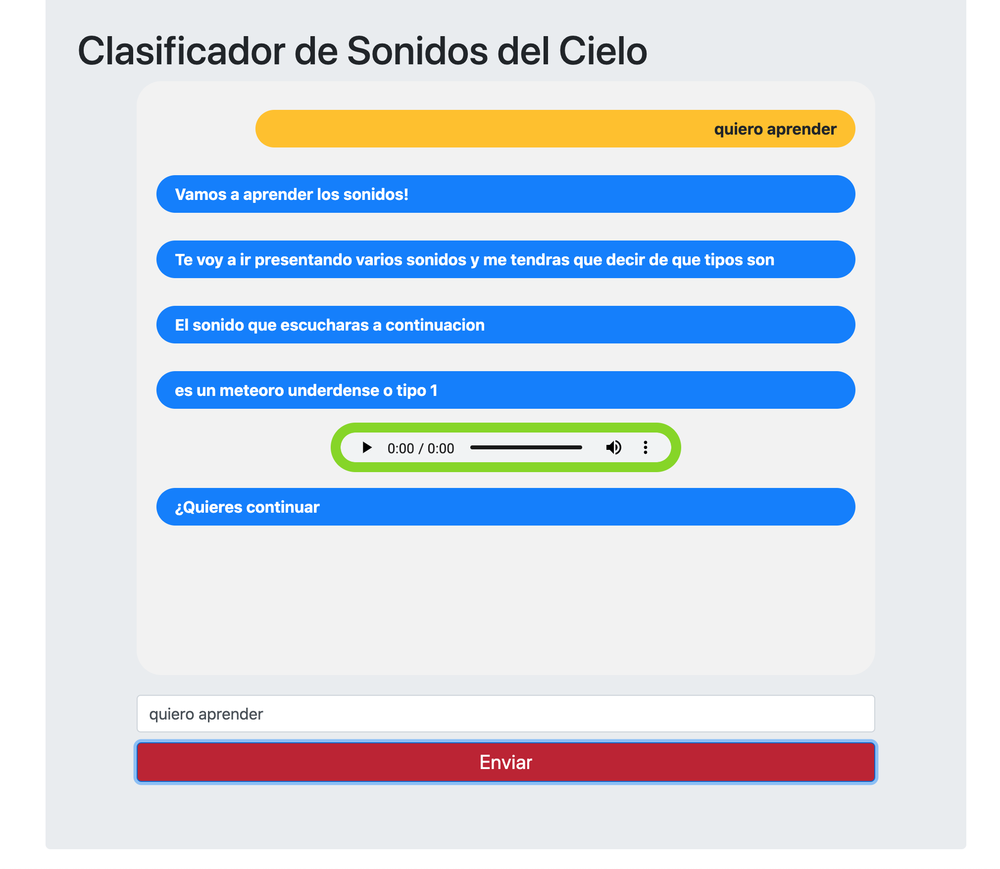

#  ChatBot para Clasificar Sonidos del Cielo
> Sky Sounds Chatbot Classifier 

---
 
---
##  Tabla de contenidos


- [Introduccíon](#Introducción)
- [About](#About )
- [Arquitectura](#Arquitectura)
- [Instalación](#instalación)
- [Características](#Características)
- [Team](#team)


---

 
## Introducción

-

---
 ## About

  - 🇬🇧 This chatbot is being developed by [Jhosef A. Cardich Palma](https://www.linkedin.com/in/jhosef-anderson-cardich-palma-74765788/) as part of his Final Degree Project (TFG) for the [Polytechnic University of Madrid ](https://www.upm.es/) as a part of its Computer Science Degree on the [Higher Technical School of Computer Engineers](https://www.fi.upm.es/). The  ***Sky Sounds Chatbot Classifier***  is an application that offers an entertaining experience to classify sounds of the sky,  bringing the general public closer to science. This application is part of
[Star counter](http://www.contadoresdeestrellas.org/), a large project in collaboration with the ***Instituto Astrofísico de Canarias***. 

---
  - 🇪🇸 Este proyecto esta siendo desarrollado por [Jhosef A. Cardich Palma](https://www.linkedin.com/in/jhosef-anderson-cardich-palma-74765788/) como el trabajo de fin de carrera en la [Universidad Politécnica de Madrid](https://www.upm.es/) para el grado de Ingeniería Informática en la [Escuela Técnica Superior de Ingenieros Informáticos](https://www.fi.upm.es/). La aplicación ***Chatbot Clasificador de Sonidos del Cielo*** tiene como objetivo la realizacion de un bot para el publico infanti, el cual podra clasificar los sonidos del cielo interactuando con el asistente virtual.  Esta aplición forma parte de un proyecto mas grande. [Contadores de Estrellas](http://www.contadoresdeestrellas.org/) es un proyecto realizado en colaboración con el ***Instituto Astrofísico de Canarias***.


 

 ---
## Arquitectura

La implementación general se ha seguido un patrón ***Modelo Vista Controlador (MVC)*** , para definir los componentes y sus interacciones. 
Let's take a look how this architecture looks like:

 ***Organización MVC del Proyecto***

 


## Instalación

 - En este repositorio se encuentra el proyecto, en el que se incluye el entorno virtual con el que se ha trabajado en  local (carpeta venv)
 sin embargo, en esta carpeta, se encuentra otra llamada "lib" (/venv/lib), la cual no se esta sincronizando con el repositorio aqui (pero si usa en local),
  debido a que  esta carpeta tiene dos modulos que pesan demasiado, por ello es recomendable, si deseas hacer funcionar esto:

 #### Configuración Entorno
- Antes que nada, tenemos que instalar [RASA](https://rasa.com/docs/rasa/user-guide/installation/)

> Instalación RASA
```
$ pip3 install rasa
```
 
 - Una vez clonado el proyecto, hay que hacer una serie de comprobaciones.
  Se ha usado el entorno Pycharm para el desarrollo del asistente, el siguiente paso hace referencia las opciones de Pycharm.
   Hay que asegurarnos que estamos usando la version de Phyton 3.7 y que el entorno venv esta configurado correctamente, 
   también lo haremos cuando hayamos instalado RASA. Podemos encontrar las configuraciones en : 

 > Abrir el proyecto con Pycharm:

 ```
> Pycharm > preferencias .. 
 ```

### Configuración del módulo del juego y del ChatBot


 ###  Modulo Back - Lógica del Juego
***Servicios  RASA***

  Otra parte escencial del proyecto es la lógica del juego, para ello se ha desarrollado una aplicación en Phyton, integrada en framework de RASA, la cuál define las funcionalidad de acceso a los sonidos, la clasificación, almacenamiento de los datos de clasificación, y otros procesamientos independientes de la parte conversacional que es el bot. Estos servicios serán usados por el bot cuando este reconozca un comando por parte del usuario.

- Para iniciar los servicios solo tenemos que situarnos en el directorio anterior y ejcutar el siguiente comando:

 ```
$ rasa run actions...
 ```
 ### Módulo Back - ChatBot


- Para entrenar nuestro modelo nos situamos en el siguiente directorio:
 ```
 "/UPM-ChatBot-SoundsOfMeteors/mvc_control_bot_juego"
 ```
 - Estando ya en el directorio, ejecutamos el siguiente comando para entrenar el modelo:
 ```
 $ rasa train 
 ```
 - Una vez que nuestro rasa ha terminado de formar el universo de nuestro bot este se encuentra ya listo para poder usarlo. Entonces podemos conversar con el bot conectando un frontal web o la consola de comandos. La segunda opción es la mas inmediata. Para poder comunicarnos con nuestro bot via consola,  ejecutamos el siguiente comando en una terminal. Este inicia el servidor RASA y ademas nos da una terminal de entrada para poder comunicarnos via texto con nuestro bot: 
> Para iniciar el servidor rasa donde correra nuestro bot:
  ```
$ rasa shell
  ```
- Si el comando se ha realizado con éxito, se mostrara un mensaje como este:

 

---
## Integración con APPS externas
En el caso de la integración con aplicaciones externas lo que tenemos que hacer para exponer 
los servicios de nuestro tenemos que seguir el siguiente comando . Se pueden realizar pruebas sobre mensajes con el software postman. 

> Exponer los servicios de nuestro bot
- Nos situamos siempre en el directorio donde hemos entrenado nuestro bot y ejecutamos:
```
$ rasa run
```

***Consumir mediante POSTMAN***

- En el caso de que el servidor se haya iniciado sin nigun problema, el aspecto de la terminar es la siguiente: 

 

***Consumir Mediante un Navegador - Cliente Web***
> Exponer los servicios de nuestro bot con Extra Google Chrome
- Si queremos conectar nuestro asistente desde un navegador, es decir, 
conectar el frontal con el controlador/modelo del proyecto, hay que usar el siguiente comando que 
 desactivara ciertas características de seguridad de RASA las cuales entran en conflicto
 con los navegadores. Esto se tiene que hacer al usar el frontal creado para el proyecto. Ejecutar el siguiente comando:

```
rasa run --enable-api --cors "*"
```
> Consumir  servicios

- Podremos consumir los servicios en la siguiente URI (`POST`): 
```
http://localhost:5005/webhooks/rest/webhook
```
---

Una prueba de operación `POST` en postman, donde se ve el mensaje enviado y la contestación del asistente. 
Hay que notar un detalle, y es que el la ultima parte del mensaje enviado por el bot ha sido generado por la
 aplicación del juego definida en las acciones de RASA, las cuales están activas porque las hemos activado
  previamente (Modulo Back - Lógica del Juego) .

 

 En ese momento los servicios estarán disponibles para que nuestro asistente pueda llamarlos si reconoce alguno en la conversación con el usuario.

---
## Configuración del Frontal

Por la arquitectura propuesta, se ha desarrollado una aplicación frontal  basada en el framework Web de Django.
- Para poder hacer funcionar el frontal de la aplicación tenemos que situarnos el diretorio:
```
/UPM-ChatBot-SoundsOfMeteors/mvc_vista_frontal/mysite
```
- Hay que arrancar el servidor de la siguiente manera: 
```shell
$ python3 manage.py runserver 0.0.0.0:8000

```


***Vista Previa Frontal***
- V1.5

 

- V2.0

 


Gracias a esta interfaz el usuario podrá ser capaz de interactuar con el asistente de manera más amigable para clasificar sonidos del cielo.

## Características

La aplicación permite la clasificación de sonidos del cielo y cuenta con las siguientes funcionalidades:

#### Aprendizaje 
- La aplicación brinda la posibilidad de poder aprender los sonidos del cielo a través del asistente conversacional.
> Para aprender el sistema responde a los siguientes comandos: 

````
- quiero aprender 
- que tipos de sonidos existen 
- dime todos los sonidos
- deseo aprender

````
#### Entrenamiento 
- Existe un nivel de entrenamiento para que el usuario pueda aprender los sonidos. En este se presentan sonidos del aprendizaje
pero sin información sobre su tipo. El sistema se encargara de evaluar la respuesta del usuario para devolver feedback sobre que 
tan acertada ha sido su respuesta. 

````
- quiero entrenar
- entrenar 
- deseo practicar
- entrenamiento
- deseo entrenarme 
- quiero practicar

````

#### Clasificación
- Es el nivel mas interesante, aqui el sistema presenta diversos tipos de sonidos que el usuario tendra que clasificar. 
Cuando el usuario clasifique un sonido, su clasificación se guarda junto con la de otros usuarios. Así cuando un sonido 
es clasificado, al usuario se le muestra el valor promedio de clasificación que otros usuarios le han dado a ese sonido
- Cuando un usuario escucha un sonido y no puede intuir de que se trata, entonce el usuario podra pedir ayuda. 
En las opciones de ayuda el usuario puede elegir reproducir cualquiera de los 5 sonidos existentes. Si el usuario aun 
se ve con dudas, puede volver a entrenar o a aprender.
> Para clasificar el sistema se activa con cualquiera de los siguientes comandos

````
- clasificar
- deseo clasificar
- quiero clasificar
- vamos a clasificar

````

### Ayuda para Clasificar 
Si el usario no se siente seguro o necesita ayuda para renocer un sonido durante una 
clasifcación, entonces el sistema puede ayudarle mostrandole algun ejemplo o repetir 
la sesión de entrenamiento.
>Para mostrar las opciones de ayuda durante la clasificación el sistema responde a los 
siguientes comandos:
````
- como se clasifica ?
- como clasificar ?
- dime como se clasifica
- ayuda para clasificar 
- me dices como clasificar 
- no se clasificar
- no puedo clasificar
- no se clasificar

````

### Tipos de Sonidos
El usuario podra reproducir un tipo de sonido en cualquier momento para recordar. Para ello se usa cualquier de los siguientes comandos. 
(Ejemplo para un overdense corto):
> Reproducir un Sonido
````
- recuerdame como suena un overdense corto 
- recuerdame como suena un meteoro tipo overdense corto 
- como suena un meteoro overdense corto 
- como suena un meteoro tipo overdense corto 
- Como suena un meteoro tipo overdense corto  ?
- quiero escuchar un overdense corto 
- reproduce un meteoro overdense corto 
- reproduce un tipo overdense corto 
````

## Dependencias

Los siguientes paquetes de software son necesarios en el sistema para poder hacer funcional la aplicación:

- [Python 3.7](https://www.python.org/)
- [Rasa](https://rasa.com/)
- [Django 3.0.7](https://www.djangoproject.com/)
- Django Rest framework 3.11.0

## Team
> Contributors/People

| <a href="https://www.linkedin.com/in/jhosef-anderson-cardich-palma-74765788/" target="_blank">***Jhosef A. Cardich Palma***</a> | 
| :---: |
| [](https://www.linkedin.com/in/jhosef-anderson-cardich-palma-74765788/)   |
| Twitter at <a href="http://twitter.com/jhosefcardich" target="_blank">`@JhosefCardich`</a>| 
|Instagram at <a href="http://instagram.com/arts_hot" target="_blank">`@ART S-HOT`</a>


---


